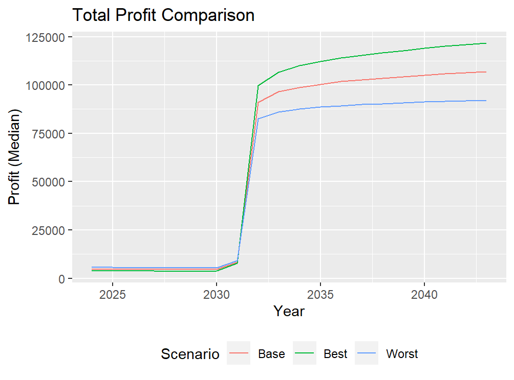

### Lumine Life Health Incentive Program
### Objectives
The main objective for the proposed health incentive program is to decrease the overall mortality of policyholders by providing assistance with smoking cessation and promoting cancer awareness. We also aim to improve sales through increased competitiveness and marketability that ultimately adds economic value to SuperLife. 

### Monitoring Objectives
#### Short term
The program should be monitored over a short period of 5 years to briefly analyse the effects of smoking cessation and cancer screenings on the mortality of policyholders, while also focusing mainly on the maintenance of cash flows due to heavier early investment for the smoking cessation program. 

#### Long term
For a longer observational period, a time horizon of 20 years was suggested to allow for an observational period which wholly encompasses the lifetime of the term insurance of 20 years. This allows for a more detailed monitoring of the predicted mortality model’s accuracy throughout the lifetime of the term insurance and the realised effect of the program on mortality rates for policyholders.

### Program Design
Lumine Life recommends implementing a program which targets two main death causes in SuperLife policyholders to reduce claims frequency: Smoking and Cancer.

#### Smoking Cessation
The smoking cessation program will be offered only to smoking policyholders, which aims to assist with smoking cessation through the use of Bupropion and proactive telephone counselling. The cost of this program will be fully covered by SuperLife for the first year and 50% covered for any recurring years afterwards, to encourage participation from smoking policyholders.

#### Cancer Awareness
An online awareness program for cancer has been suggested to inform and provide insight into the different methods to prevent and identify key cancer causes. This was determined to be a viable solution through identifying ignorance and late detection being the root causes of death from cancer. To encourage participation, a $200 voucher towards a cancer screening or CT scan would be provided annually to all policyholders who have successfully completed the cancer awareness course, to assist in facilitating early detection of cancer.

### Pricing
#### Modelling Method
Annual in-force policyholder data was projected over a 20 year period alongside corresponding projected interest rates and mortality. The empirical mortality was selected as a benchmark for evaluating model performance, with various models tested before the Whittaker-Henderson smoothing model was selected to project mortality. Focusing on the insurance benefit created by the proposed program, profits were evaluated as incremental quantities, meaning initial expenses and frictional costs were excluded from the calculation.

#### Results
Using the model, mortality savings for the past 20 years were generated:
<table><tbody><tr><th>Real Payments</th><th>Expected (Pre-intervention)</th><th>Expected (Post-intervention)</th><th>Expected Mortality Savings</th></tr><tr><td>31.31 billion Lumarian Crowns</td><td>30.39 billion Lumarian Crowns</td><td>6.35 billion Lumarian Crowns</td><td>4.04 billions Lumarian Crowns</td></tr></tbody></table>
<i>Table 1: Comparison of Mortality Savings for the past 20 years</i>

&nbsp;

As well as the projected increase in profits per Č1,000 death benefits over 5 years.
<table><tbody><tr><th><strong>Year</strong></th><th><strong>Median</strong></th><th><strong>Mean</strong></th></tr><tr><td>2024</td><td>83.96</td><td>425.18</td></tr><tr><td>2025</td><td>84.82</td><td>436.24</td></tr><tr><td>2026</td><td>85.35</td><td>447.44</td></tr><tr><td>2027</td><td>85.95</td><td>458.53</td></tr><tr><td>2028</td><td>86.76</td><td>468.30</td></tr></tbody></table>
<i>Table 2: Increase in profits per Č1,000 death benefits with the program</i> 

&nbsp;

Resulting from the implementation of the health incentive program, there has been an increase in overall premiums for all policyholders. These increases could be adjusted for more competitive pricing at the cost of profit. 
<table><tbody><tr><th><strong>Min</strong></th><th><strong>Q1</strong></th><th><strong>Median</strong></th><th><strong>Mean</strong></th><th><strong>Q3</strong></th><th><strong>Max</strong></th></tr><tr><td>-355.72</td><td>5.07</td><td>12.74</td><td>24.16</td><td>30.60</td><td>105.36</td></tr></tbody></table>
<i>Table 3: Avg. statistics of premium increase per Č1,000 death benefits with program</i>

### Assumptions
The health incentive program’s costs are composed of both fixed and variable parts, with the variable part being affected by assumptions. One key assumption is full participation from policyholders, which likely overestimates costs since participation is optional. Additionally, assumptions about smoking cessation’s impact on mortality was based on Gilpin’s (1997) research, suggesting that the effects start after 4 years of commencing the program, which potentially underestimates costs if participation exceeds 4 years. Furthermore, due to data limitations, the effect of cancer screening on mortality is assumed constant over age, simplifying profit modelling but possibly affecting accuracy. This assumption is significant as they influence the program’s cost estimation and overall profit projections.  

### Risk and Risk Mitigation Considerations
There are a multitude of risks that can potentially impact the proposed health incentive program. Some of the main ones are listed below with their risk mitigation strategy.

<table><tbody><tr><th>
<strong>Risk</strong>
</th><th>
<strong>Mitigation Strategy</strong>
</th></tr><tr><td>
<strong>Inflation Risk (Quantitative):</strong>

Long-term policies are susceptible to rising costs.
</td><td><ul><li>Build inflation protection into pricing models</li><li>Set aside reserves for future costs</li></ul></td></tr><tr><td>
<strong>Adverse Selection Risk (Quantitative):</strong>

When more individuals with higher health risks participate, leading to an imbalanced risk pool.
</td><td><ul><li>Transfer excess risk to reinsurers</li><li>Account for this risk in the model</li></ul></td></tr><tr><td>
<strong>Underwriting Risk (Quantitative):</strong>

Inappropriate assessment of policyholder’s key risk features.
</td><td><ul><li>Conduct comprehensive evaluation of policyholder attributes at entry</li></ul></td></tr><tr><td>
<strong>Participation Risk (Qualitative):</strong>

Policyholders may not actively participate, leading to a suboptimal outcome
</td><td><ul><li>Regular communication about benefits</li><li>Reach out to inactive participants</li><li>Include additional incentives</li></ul></td></tr><tr><td>
<strong>Communication / Education Risk (Qualitative):</strong>

Policyholders may not understand or have a lack of awareness of the benefits that the program provides.
</td><td><ul><li>Consistent and proper marketing</li><li>Content is well presented</li></ul></td></tr><tr><td>
<strong>Motivation Risk (Qualitative):</strong>

Over time, participants may lose interest in the program
</td><td><ul><li>Give annual rewards like subsidy on screening if program has been completed</li></ul></td></tr></tbody></table>

To test the limits of these risks, a sensitivity analysis was conducted to portray the effects of key financial impacts on the profit as depicted in Figure 3. The key financial impacts assessed were interest rate, cost of incentive programs and policy lapse rate. Under all cases, there is a steep increase in profits due to the lagged contribution of the incentive programs via mortality savings. This suggests that the company should maintain enough liquid capital in the early states to fund the incentive programs until they see a return on investment.

_Figure 1: Sensitivity Analysis for Profit_

The analysis also considered the certainty of projected values. The predicted decrease in mortality over the past 20 years has an average degree of certainty due to reliance on outdated data and research. Nonetheless, the health incentive program is expected to reduce mortality, supported by scientific evidence. The value of policies under the program is likely to be higher than those without, thanks to the program’s design that benefits both the company and policyholders. Even for non-participants, the program adds value by enhancing market competitiveness.company should maintain enough liquid capital in the early states to fund the incentive programs until they see a return on investment.

### Data and Data Limitations
Below is a summary of the data limitations and their impact on the analysis:

**Jama Network:**

- **Limitation:** Broad racial/ethnic categories, single-point smoking data, no disease status separation
- **Impact:** Affects the accuracy of smoking cessation’s impact on mortality rates and profit calculations.

**Science Direct:**

- **Limitation:** Homogeneity assumptions, single intervention model, short-term abstinence measure, findings from one trial.
- **Impact:** Influences the cost estimation of smoking programs and profit outcomes.

**International Agency for Research on Cancer - WHO:**

- **Limitation:** Variable quality and completeness of cancer registry data.
- **Impact:** Affects the relevance of cancer death rates data.

**National Library of Medicine:**

- **Limitation:** Small sample size, fixed attendance rate, exclusion of certain cancers, omission of treatment-related deaths.
- **Impact:** Impacts the accuracy of mortality rate of changes for cancer programs and profit.

**Oxford Academic - Journal of the National Cancer Institute:**

- **Limitation:** Cohort representativeness, self-reported smoking status, abstinence definition.
- **Impact:** Questions the relevance of data for determining the quitting time period.

**Society of Actuaries:**

- **Limitation:** AI-generated data with static variables, non representative sample, limited to one term insurance.
- **Impact:** Affects the overall analysis due to numerous assumptions based on limited data.
